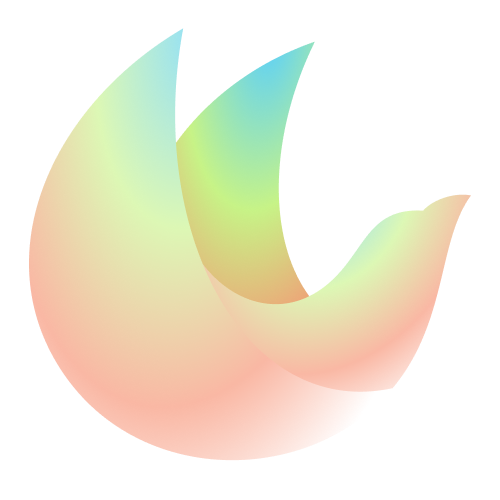

<!-- PROJECT LOGO -->
 

  

  <h1 align="center">Vira Theme</h3>

  

    Original taste, original colors.
  

## The story

Vira Theme is the official successor of the original Material Theme, this brand new theme has been in development since 2024 (in my free time), it's completely written from scratch with 0 dependencies and has improved experience. We decided to change the name because this version is no more bound to the **Material Design System** and we want to follow our path.

#### A bit of history:
This theme was originally intended to be the Pro version of Material Theme the popular theme with over 7 million lovers, and a bunch of haters.

## Main features

Compared to other Material Theme clones made by clowns, this official version has:

- **Enhanced User Experience** – A refined, visually cohesive design.
- **Hand-Curated Icons** – Hundreds of new beautifully crafted icons for files and folders.
- **Advanced Customization** – Features like automatic accent sync, gradient icons, and more.
- **Regular Updates** – Continuous improvements and optimizations.
- **Dark themes only** - Unlike the old Material Theme, Vira Theme focuses exclusively on dark themes and does not include any lighter variants. This ensures a sleek, distraction-free coding experience tailored for developers who prefer a darker interface and environments.
- **And Much More!**

## Installation and usage

Checkout our discussion board for more info

### [Get started ↗️](https://github.com/vira-themes/vira-theme-support/discussions/1319)

## How to customize colors

If you want to customize some colors you can use VSCode Settings to match your taste.

### [Learn how ↗️](https://github.com/vira-themes/vira-theme-support/discussions/1318)

